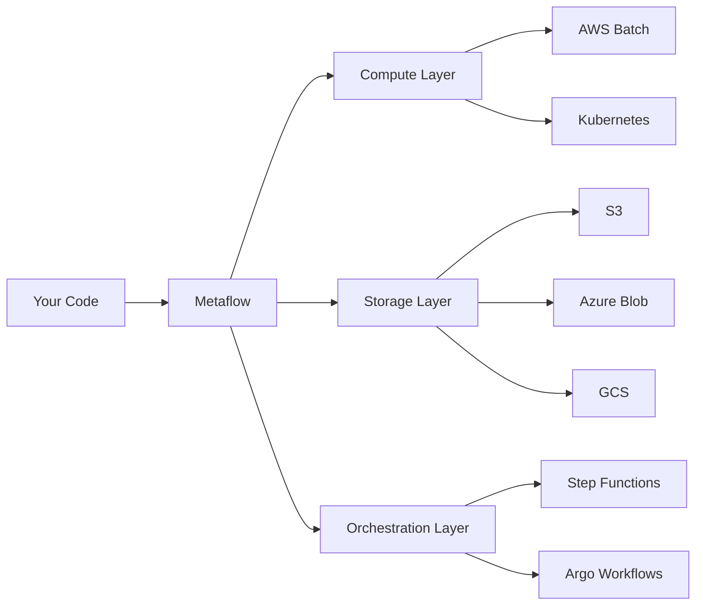

Metaflow provides native support for running workflows across multiple cloud platforms, allowing you to leverage cloud resources for compute, storage, and orchestration while keeping your code portable.

## Supported Cloud Platforms

<CardGroup cols={3}>
  <Card title="AWS" icon="aws" href="/cloud/aws">
    Full-featured support with Batch, S3, Step Functions, and Secrets Manager
  </Card>
  <Card title="Azure" icon="microsoft" href="/cloud/azure">
    Native integration with Blob Storage and Key Vault
  </Card>
  <Card title="GCP" icon="google" href="/cloud/gcp">
    Support for Cloud Storage and Secret Manager
  </Card>
</CardGroup>

## Cloud-Native Features

Metaflow integrates with cloud services to provide:

### Compute

- **Elastic scaling**: Run compute-intensive steps on cloud resources with CPUs and GPUs
- **Container support**: Use custom Docker images for dependencies and environments
- **Distributed computing**: Gang-scheduled multi-node parallel processing

### Storage

- **Object storage**: Automatic artifact persistence to S3, Azure Blob Storage, or GCS
- **Data tools**: Fast parallel data access for large datasets
- **Versioning**: Immutable data lineage tracked across all runs

### Orchestration

- **Production workflows**: Deploy to AWS Step Functions, Argo Workflows, or Airflow
- **Event triggering**: React to cloud events and schedule executions
- **Reliability**: Built-in retry logic and failure recovery

### Security

- **Secrets management**: Integrate with AWS Secrets Manager, Azure Key Vault, or GCP Secret Manager
- **IAM integration**: Use cloud-native identity and access management
- **Encryption**: Server-side encryption for data at rest

## Quick Start

Choose your cloud platform to get started:

<Steps>
  <Step title="Select Your Cloud">
    Configure Metaflow for your preferred cloud provider:
    - [AWS Setup](/cloud/aws)
    - [Azure Setup](/cloud/azure)
    - [GCP Setup](/cloud/gcp)
  </Step>
  
  <Step title="Configure Datastore">
    Set your cloud storage as the default datastore:
    ```bash
    # AWS
    export METAFLOW_DEFAULT_DATASTORE=s3
    export METAFLOW_DATASTORE_SYSROOT_S3=s3://my-bucket/metaflow
    
    # Azure
    export METAFLOW_DEFAULT_DATASTORE=azure
    export METAFLOW_DATASTORE_SYSROOT_AZURE=container/metaflow
    
    # GCP
    export METAFLOW_DEFAULT_DATASTORE=gs
    export METAFLOW_DATASTORE_SYSROOT_GS=gs://my-bucket/metaflow
    ```
  </Step>
  
  <Step title="Run on Cloud">
    Use decorators to run steps in the cloud:
    ```python
    from metaflow import FlowSpec, step, batch
    
    class MyFlow(FlowSpec):
        @batch(cpu=4, memory=8000)
        @step
        def compute_heavy_step(self):
            # This runs on AWS Batch
            self.result = expensive_computation()
            self.next(self.end)
        
        @step
        def end(self):
            print(f"Result: {self.result}")
    ```
  </Step>
</Steps>

## Architecture

Metaflow's multi-cloud architecture separates concerns:



### Layered Design

- **API Layer**: Consistent Python API across all clouds
- **Plugin Layer**: Cloud-specific implementations for compute, storage, and secrets
- **Infrastructure Layer**: Native cloud services (Batch, S3, etc.)

## Code Portability

One of Metaflow's key strengths is code portability. The same flow code runs locally, on AWS, Azure, or GCP with minimal configuration changes:

```python
from metaflow import FlowSpec, step, batch, kubernetes

class PortableFlow(FlowSpec):
    @batch  # Runs on AWS Batch when deployed to AWS
    @kubernetes  # Or runs on Kubernetes when deployed there
    @step
    def process(self):
        # Same code, different infrastructure
        self.result = compute()
        self.next(self.end)
    
    @step
    def end(self):
        print(f"Result: {self.result}")
```

## Hybrid Cloud

Metaflow supports hybrid cloud scenarios:

- Run development locally, production in cloud
- Split workloads across multiple clouds
- Use different clouds for different steps in the same flow

## Best Practices

<AccordionGroup>
  <Accordion title="Choose the Right Cloud Service">
    - Use managed compute services (Batch, Kubernetes) for scalability
    - Leverage object storage (S3, Blob, GCS) for artifacts
    - Use cloud-native secrets managers for credentials
  </Accordion>
  
  <Accordion title="Optimize Costs">
    - Right-size compute resources with `@resources` decorator
    - Use spot instances for fault-tolerant workloads
    - Implement data lifecycle policies for storage
  </Accordion>
  
  <Accordion title="Ensure Security">
    - Never hardcode credentials—use secrets managers
    - Follow least-privilege IAM principles
    - Enable encryption for data at rest and in transit
  </Accordion>
  
  <Accordion title="Monitor Performance">
    - Track resource utilization metrics
    - Monitor cloud service quotas and limits
    - Use Metaflow Cards for visualization
  </Accordion>
</AccordionGroup>

## Cloud Provider Comparison

| Feature | AWS | Azure | GCP |
|---------|-----|-------|-----|
| Compute | AWS Batch | Kubernetes | Kubernetes |
| Storage | S3 | Blob Storage | Cloud Storage |
| Orchestration | Step Functions | Argo Workflows | Argo Workflows |
| Secrets | Secrets Manager | Key Vault | Secret Manager |
| Container Registry | ECR | ACR | GCR |
| Maturity | ⭐⭐⭐ Full | ⭐⭐ Good | ⭐⭐ Good |

## Next Steps

<CardGroup cols={2}>
  <Card title="AWS Setup" icon="aws" href="/cloud/aws">
    Configure Metaflow for AWS with Batch and Step Functions
  </Card>
  <Card title="Azure Setup" icon="microsoft" href="/cloud/azure">
    Set up Azure Blob Storage and Key Vault integration
  </Card>
  <Card title="GCP Setup" icon="google" href="/cloud/gcp">
    Configure GCP Cloud Storage and Secret Manager
  </Card>
  <Card title="Kubernetes" icon="dharmachakra" href="/scaling/kubernetes">
    Run Metaflow on any Kubernetes cluster
  </Card>
</CardGroup>